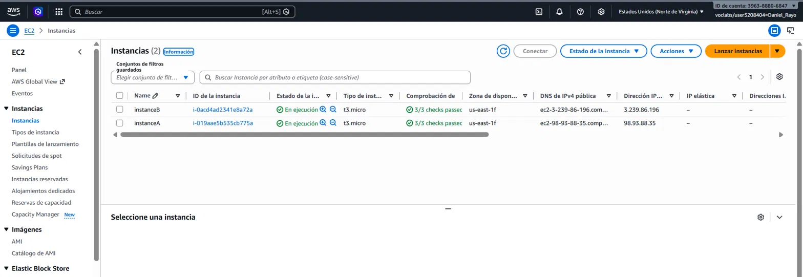
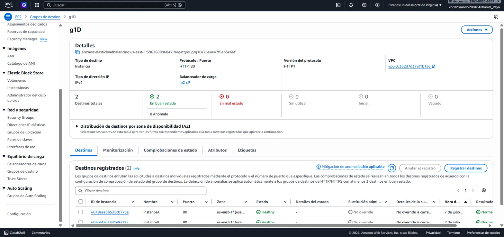
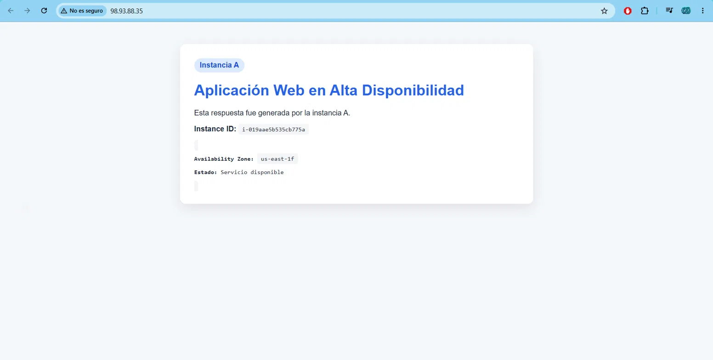
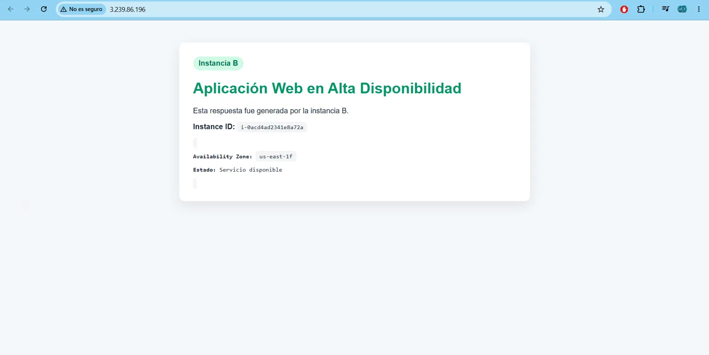
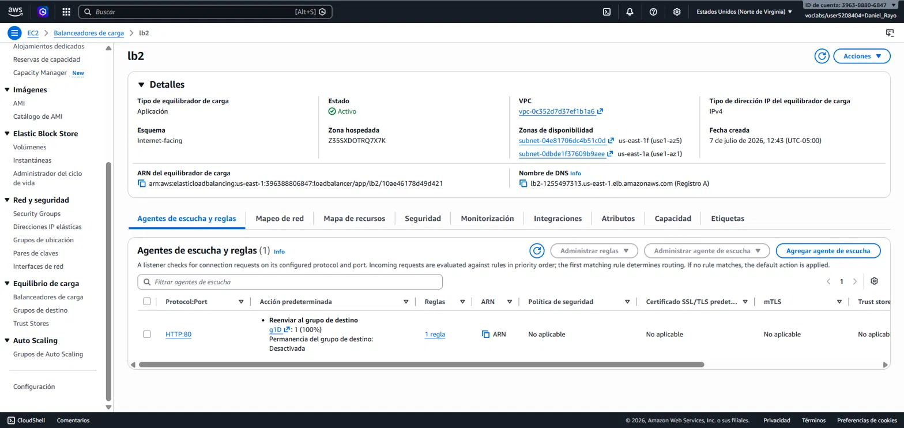
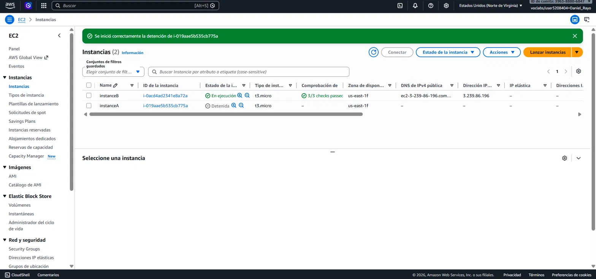
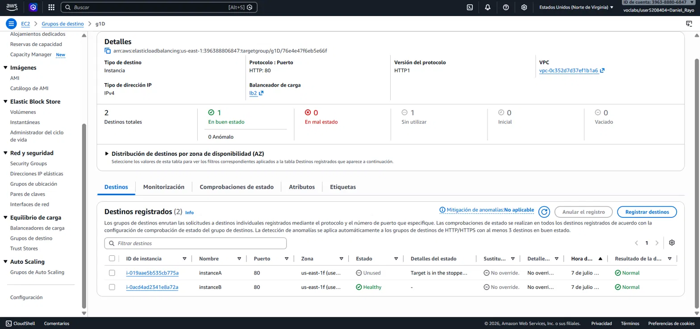
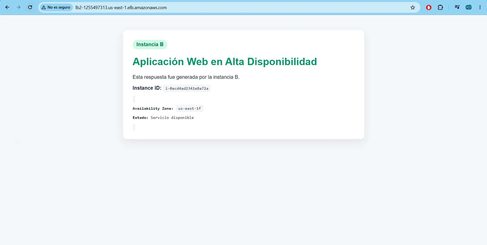

# High Availability with Application Load Balancer on AWS


## 1. Implemented Architecture

```
User / Browser / curl
          │
          ▼
Application Load Balancer (lb2)
   Public DNS: lb2-1255497313.us-east-1.elb.amazonaws.com
          │
   ┌──────┴──────┐
   ▼             ▼
EC2 instanceA  EC2 instanceB
us-east-1f     us-east-1f
Apache HTTPD   Apache HTTPD
```

- **Target Group:** `g1D` (HTTP:80, health check on `/health`)
- **ALB Security Group:** allows HTTP (80) from `0.0.0.0/0`
- **EC2 Security Group:** allows HTTP (80) only from the ALB's Security Group

## 2. Evidence

### 2.1 EC2 instances running

Both instances running with status checks passed.



### 2.2 Target Group with Healthy targets

The `g1D` target group shows both instances in *Healthy* status.



### 2.3 Response from instance A

Direct access via public IP, confirming instance A's individual response.



### 2.4 Response from instance B

Direct access via public IP, confirming instance B's individual response.



### 2.5 Active Application Load Balancer

The `lb2` load balancer in *Active* status, with an HTTP:80 listener forwarding to the `g1D` target group.



### 2.6 Failure simulation — instance stopped

`instanceA` was stopped to simulate a failure.



### 2.7 Target Group during the failure

The Target Group reflects that `instanceA` is no longer available (*stopped/unused*), while `instanceB` remains *Healthy*.



### 2.8 System remains available during the failure

Testing the Load Balancer's DNS during the failure, the system responds exclusively from instance B, confirming that the service remained available.



## 3. Analysis Activities

### 3.1 Activity 1: Load balancing analysis

- **Which instance responded first?** Depends on the ALB's internal distribution algorithm; during testing it alternated between A and B with no fixed pattern.
- **Did the load balancer alternate between both instances?** Yes, reloading the ALB's DNS multiple times alternated responses between the blue card (A) and the green card (B).
- **What information confirms that more than one instance is active?** Each page displays a different `Instance ID` and `Availability Zone`.
- **What role does the Target Group play?** It groups the EC2 instances, defines the target protocol/port, and runs the periodic health checks.
- **What role do health checks play?** They verify that each instance responds correctly on `/health`; if one fails, the ALB stops sending it traffic.
- **Why doesn't the user need to know the instances' public IPs?** Because the ALB is the single entry point (via DNS); it abstracts away changes and failures happening behind it.

### 3.2 Activity 2: Failure analysis

- **What happened when instance A was stopped?** The health check stopped receiving a response from A, the Target Group marked it as unavailable, and the ALB stopped sending it traffic.
- **Did the entire system become unavailable?** No. Instance B continued handling all requests with no visible interruption to the user.
- **What did the Load Balancer do when it detected the failure?** It detected the failure through the health check and redirected 100% of the traffic to instance B.
- **What difference would there be with only one instance?** The service would have been completely offline.
- **What quality attribute does this architecture improve?** Availability, fault tolerance, and system resilience.

### 3.3 Activity 3: Recovery analysis

- **What happened when instance A became healthy again?** The health check began receiving correct responses from A again, and the Target Group reincorporated it into the pool of active targets.
- **Did the load balancer resume sending it traffic?** Yes, the ALB resumed distributing requests, alternating between A and B once more.
- **Why is it important for recovery to be automatic from the user's perspective?** Because the user perceives no interruption and doesn't need to intervene; the system restores itself without affecting the service experience.
- **What limitations does this architecture have if the instance is not restarted manually?** Without Auto Scaling, if an instance fails and no one restarts it, the system keeps running on a single instance indefinitely, losing redundancy and becoming exposed again to a single point of failure.

### 3.4 Activity 4: Improvement proposal

- **How would you add automatic recovery?** With an Auto Scaling Group configured with a Launch Template, a desired/minimum capacity of 2 instances, and integration with the ALB's health checks to automatically replace unhealthy instances.
- **How would you protect the instances so they are not public?** By moving them to private subnets, with no public IP, accessible only through the ALB; outbound traffic (updates, packages) would be handled via a NAT Gateway.
- **How would you add HTTPS?** With a certificate managed by AWS Certificate Manager (ACM), adding an HTTPS listener (443) to the ALB, and automatically redirecting HTTP (80) traffic to HTTPS.
- **How would you log metrics and logs?** By enabling ALB Access Logs to an S3 bucket, and using CloudWatch for metrics (latency, request count, error codes) and alarms for instance failures.
- **How would you handle zero-downtime deployments?** With a Blue/Green strategy: a new version is deployed to a parallel Target Group, and the ALB's listener is switched once it's validated, without interrupting existing traffic.
- **What components would you add for a highly available database?** Amazon RDS in Multi-AZ mode, with a synchronous replica in another availability zone and automatic failover in case of a primary node failure.

## 4. Architectural Validation

| Element | Function in the architecture |
|---|---|
| EC2 instanceA | Apache web server in zone us-east-1f |
| EC2 instanceB | Apache web server in zone us-east-1f |
| Application Load Balancer (lb2) | Single entry point; distributes traffic across instances |
| Target Group (g1D) | Groups the instances and runs health checks |
| Health Check | Periodically verifies each instance's availability (`GET /health`) |
| ALB Security Group | Allows HTTP traffic from the Internet |
| EC2 Security Group | Allows HTTP traffic only from the ALB |

## 5. Limitations and Production Improvement Proposal

**Limitations of the current architecture:**
- No automatic recovery: if an instance fails, the ALB stops routing traffic to it, but does not replace or restart it.
- Instances are public-facing (direct IP exposure), which is not ideal for production.
- No encryption (HTTPS) on the traffic.
- No centralized monitoring or metrics.

**Proposed evolution (summary, see Activity 4 for details):**
- Auto Scaling Group with automatic recovery
- Private subnets + NAT Gateway
- HTTPS via ACM
- Logs and metrics in S3/CloudWatch
- Blue/Green deployments
- RDS Multi-AZ database

## 6. Resource Cleanup

At the end, resources were deleted in the following order: Load Balancer → Target Group → EC2 Instances → Security Groups, to avoid unnecessary credit consumption in AWS Academy.